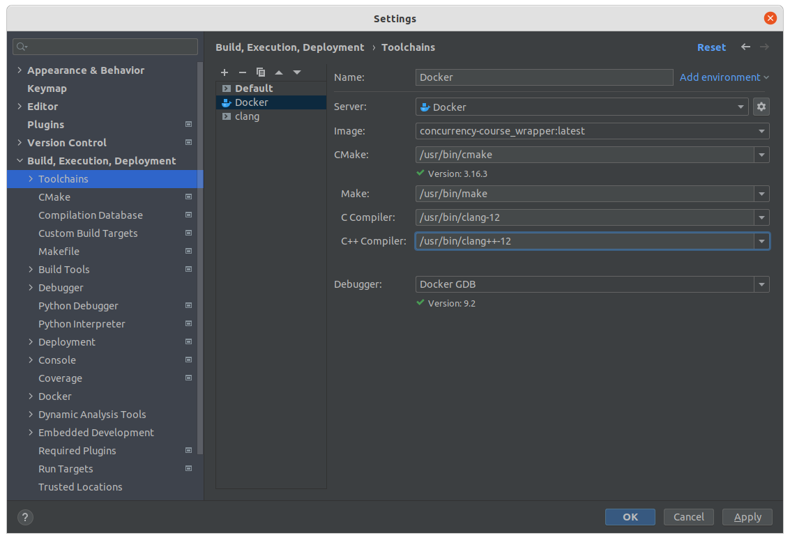
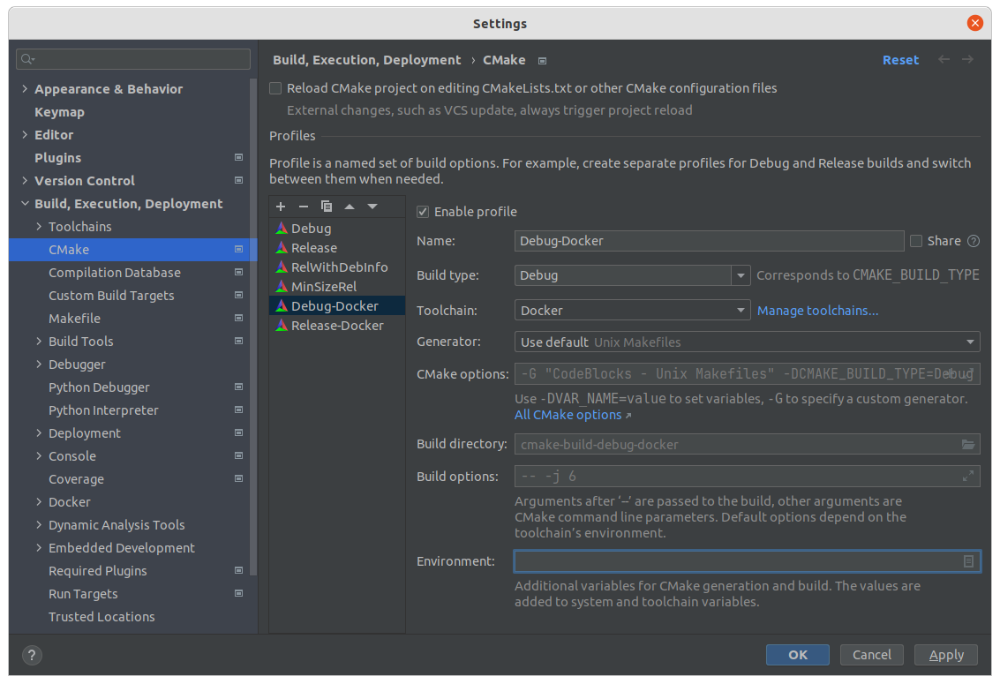

# Настройка CLion

## Начальная настройка

### Шаг 0

Установите свежую версию [CLion](https://www.jetbrains.com/ru-ru/clion/).

### Шаг 1

Курс – это CMake-проект, так что просто откройте его в CLion: `File` > `Open...` > выбрать директорию локального репозитория курса (`concurrency-course`).

### Шаг 2

Настраиваем [Remote development](https://www.jetbrains.com/help/clion/remote-projects-support.html) для работы в контейнере.

В `Preferences` > `Build, Execution, Deployment` > `Toolchains` создайте Remote Host и заполните поля как на скриншоте:

#### 2.1 Credentials

Нажмите на шестеренку в поле `Credentials` и создайте `SSH Configuration`:

| Поле | Значение |
|---|---|
| _Host_ | `127.0.0.1` |
| _Port_ | `3333`
| _User name_ | `clion_user` |
| _Password_ | `password` |

#### 2.2 Tools

Заполните поля:

| Поле | Значение |
|---|---|
| _Make_ | `/usr/bin/make` |
| _C Compiler_ | `/usr/bin/clang-12`
| _C++ Compiler_ | `/usr/bin/clang++-12` |

Проверьте, что в поле `Make` вы написали путь именно к `make`, а не к `cmake`.

### Шаг 3

В `Preferences` > `Build, Execution, Deployment` > `CMake` добавьте новый профиль сборки и установите в нем созданный шагом ранее тулчейн:

### Шаг 4

Исключите из синхронизации с контейнером директории `build` и `client` из корня репозитория:

[Exclude a local folder from upload/download](https://www.jetbrains.com/help/clion/excluding-files-and-folders-from-deployment.html#exclude_by_name)

`Preferences` > `Build, Execution, Deployment` > `Deployment` > выбрать настроенный на предыдущем шаге профиль > вкладка `Excluded Paths`

### Шаг 5

Готово! Теперь можно выбрать в IDE цель с задачей / тестами и запустить её!

## Полезные советы

- Иногда в CLion залипает синхронизация файлов между хост-системой и контейнером. Чтобы форсировать синхронизацию, нажмите ПКМ по директории курса и в контекстном меню выберите `Deployment` > `Upload to`.

- В окошке `Terminal` можно залогиниться в контейнер и работать там с консольным клиентом `clippy` не покидая IDE.
